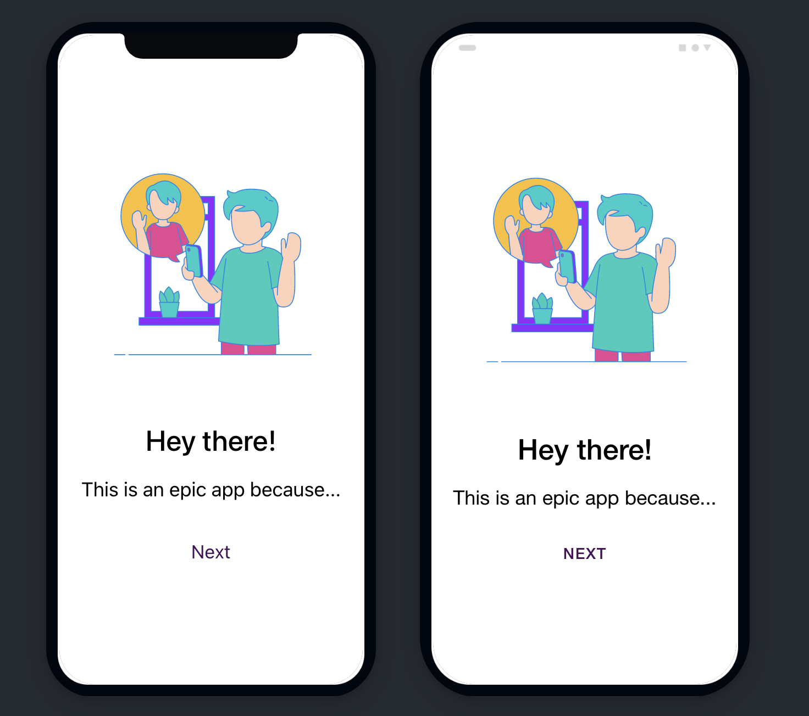
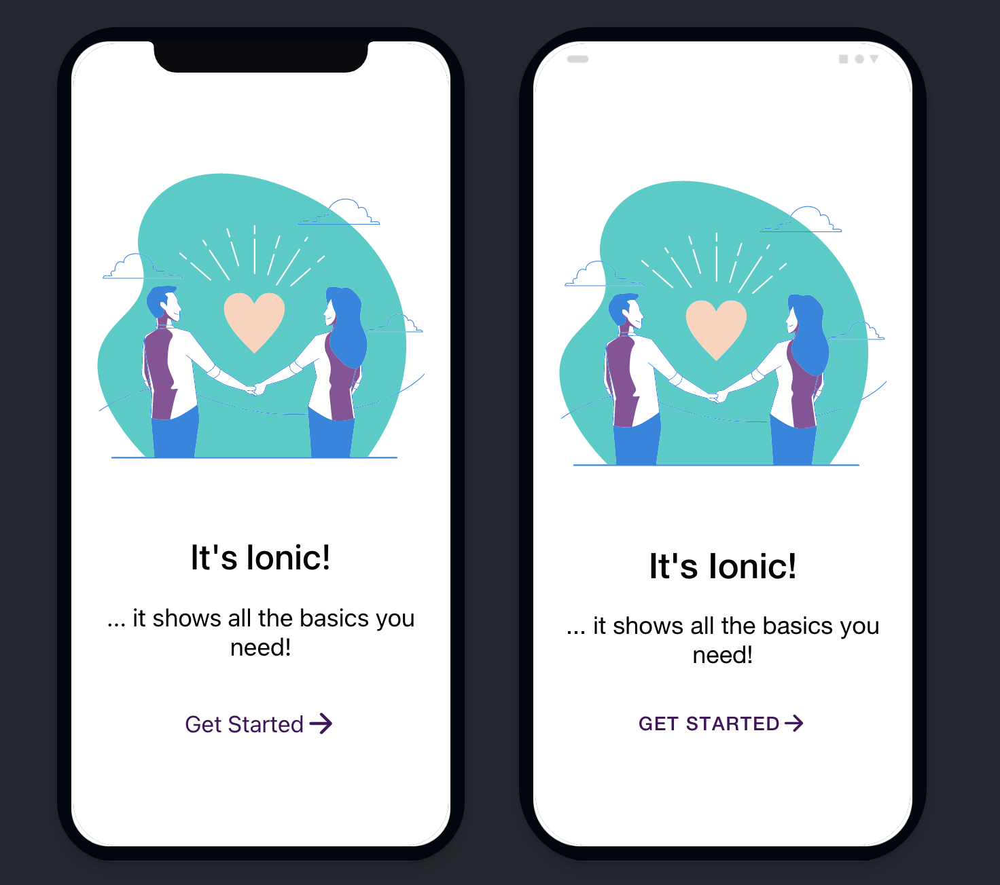
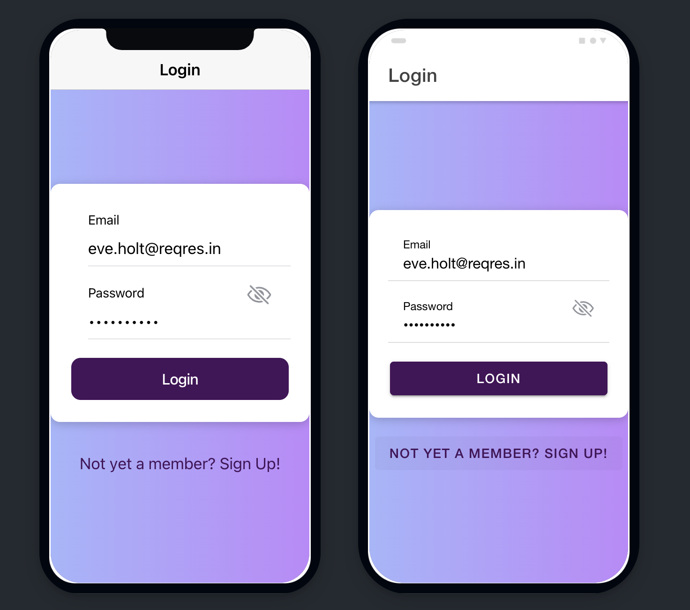
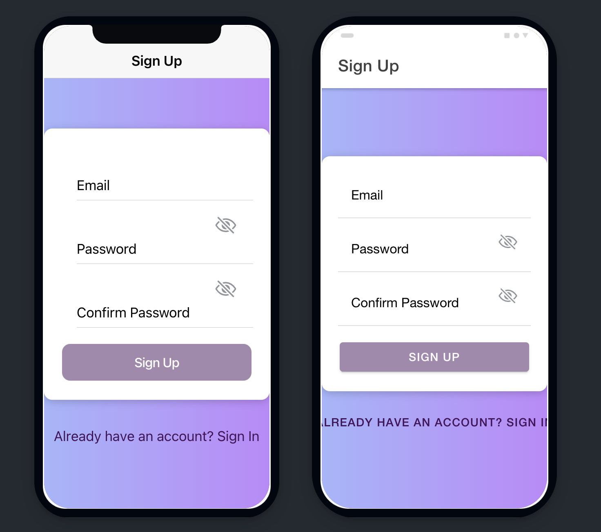
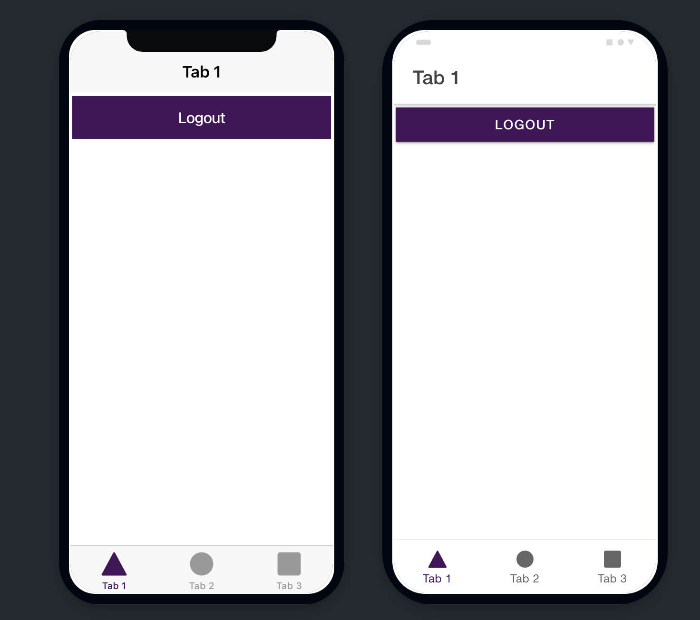

# Ionic Starter Template:

This starter template provides a simple login and registration system using Angular and a fake API from https://reqres.in. The fake API allows you to test the functionality of the login and registration system without the need for a real API.

## Getting Started

To get started with this template, follow these steps:

## 1. Clone the repository to your local machine:

```
git clone https://github.com/blaiseAI/ionic-starter-with-login-signup.git
```

## 2. Install the dependencies:

```
npm install
```

## 3. Start the development server:

```
ng serve
```

4. Navigate to http://localhost:4200/ in your browser to see the login and registration pages.

## Features

Includes the following features:

- Login and registration using fake API from [https://reqres.in](https://reqres.in/)
- JWT token authentication
- Using Capacitor preferences to store JWT securely
- Guarded routes to protect unauthorized access
- Onboarding intro slider for first-time users
- Automatic login with saved JWT token
- Email & Password validation for signup form
- Responsive design with Ionic components
- Routing to navigate between login, registration, and protected pages.

## Technologies Used

This starter template uses the following technologies:

- Ionic Framework
- Angular
- RxJS
- TypeScript
- Fake API from https://reqres.in

## Usage

## Login

The login functionality is implemented using the /api/login endpoint from the Reqres API. To log in, use the following credentials:

```
Email: eve.holt@reqres.in
Password: cityslicka
```

## Signup

The signup functionality is implemented using the /api/register endpoint from the Reqres API. To sign up, use any valid email address and a password of your choice.

## API

## Login

Endpoint: `/api/login`

Request:

```json
{
  "email": "eve.holt@reqres.in",
  "password": "cityslicka"
}
```

Response:

```json
{
  "token": "QpwL5tke4Pnpja7X4"
}
```

## Signup

Endpoint: `/api/register`

Request:

```json
{
  "email": "john.doe@example.com",
  "password": "password"
}
```

Response:

```json
{
  "id": 4,
  "token": "QpwL5tke4Pnpja7X4"
}
```

## Next Steps

Once you have explored the functionality of this starter template and are ready to move on to building your own application, there are several next steps you can take:

1. Add own Authentication API
   - Replace the fake API from reqres.in with your own custom backend API in the `AuthenticationService`
2. Add additional ionic pages

## Screenshot

## Onboarding




## Login



## Signup



## Authenticated user

